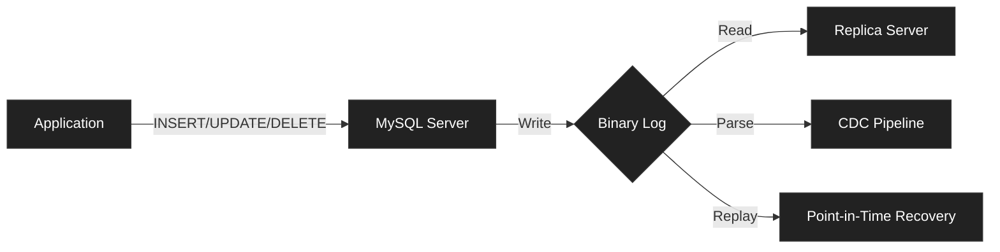
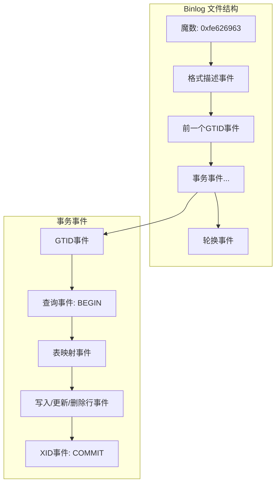
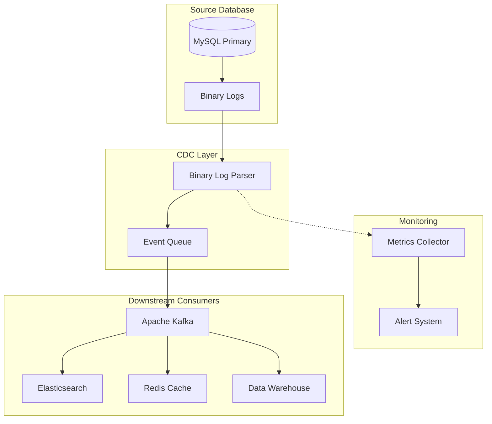

# 如何实现 MySQL 二进制日志解析

## 什么是 MySQL 二进制日志？

二进制日志是对所有数据库修改操作的**顺序记录**。MySQL 在提交事务之前会先写入该日志，因此它是记录**数据何时发生了何种变更**的权威来源。

Binlog 主要有三大用途：

- **主从复制**：从库读取主库的二进制日志，保持数据同步。
- **基于时间点的恢复**：在恢复备份后，重放二进制日志事件，将数据恢复到指定时间点。
- **变更数据捕获（CDC）**：将行级别的数据变更实时推送到外部系统，如 Kafka、Elasticsearch 或数据仓库。



## 二进制日志格式

MySQL 支持三种二进制日志格式，各有不同的优缺点：

|   格式    |                         说明                         |                    使用场景                    |
| :-------: | :--------------------------------------------------: | :--------------------------------------------: |
| STATEMENT |               记录修改数据的 SQL 语句                | 日志紧凑，但非确定性函数可能导致主从数据不一致 |
|    ROW    |       记录实际的行数据变更（变更前 / 后镜像）        |    结果确定，是 CDC 必需格式，日志体积更大     |
|   MIXED   | 默认使用语句模式，遇到非确定性操作时自动切换为行模式 |           在日志大小与安全性之间折中           |

对于 **变更数据捕获（CDC** 和可靠的主从复制，**强烈推荐使用 ROW 格式**。它能精确捕获行级别的数据变更，消除歧义。

```mysql
-- Check current binlog format
SHOW VARIABLES LIKE 'binlog_format';

-- Set to ROW format (requires SUPER privilege)
SET GLOBAL binlog_format = 'ROW';

-- For permanent change, add to my.cnf:
-- [mysqld]
-- binlog_format = ROW
```

## 启用与配置二进制日志

必须在 MySQL 配置中**启用二进制日志功能**。下面是一份可直接用于生产环境的配置：

```ini
# /etc/mysql/mysql.conf.d/mysqld.cnf

[mysqld]
# Enable binary logging with a descriptive prefix
log_bin = /var/log/mysql/mysql-bin

# Use ROW format for deterministic replication and CDC
binlog_format = ROW

# Include full row images for UPDATE statements (before + after)
binlog_row_image = FULL

# Set a unique server ID (required for replication)
server_id = 1

# Expire old binlog files after 7 days
binlog_expire_logs_seconds = 604800

# Maximum size per binlog file (rotate at 100MB)
max_binlog_size = 104857600

# Sync binlog to disk after each transaction for durability
sync_binlog = 1

# Enable GTID for easier replication management (MySQL 5.6+)
gtid_mode = ON
enforce_gtid_consistency = ON
```

修改配置后，重启 MySQL 并验证：

```bash
# Restart MySQL service
sudo systemctl restart mysql

# Verify binary logging is enabled
mysql -e "SHOW VARIABLES LIKE 'log_bin';"
# Should show: log_bin | ON

# List current binlog files
mysql -e "SHOW BINARY LOGS;"
```

## 使用 mysqlbinlog 工具

mysqlbinlog 工具是读取和解码二进制日志的标准工具，它能将二进制格式转换为人类可读的 SQL 语句或事件数据。

### 基本用法

```bash
# 读取二进制日志文件并输出可读事件
mysqlbinlog /var/lib/mysql/mysql-bin.000001

# 从指定位置开始读取
mysqlbinlog --start-position=4 /var/lib/mysql/mysql-bin.000001

# 读取指定时间范围内的日志事件
mysqlbinlog --start-datetime="2026-01-27 00:00:00" \
            --stop-datetime="2026-01-27 23:59:59" \
            /var/lib/mysql/mysql-bin.000001
            
# 解码行事件（ROW 格式必须使用）
mysqlbinlog --base64-output=DECODE-ROWS -v /var/lib/mysql/mysql-bin.000001

# 更详细展示（显示字段类型）
mysqlbinlog --base64-output=DECODE-ROWS -vv /var/lib/mysql/mysql-bin.000001
```

### 从远程服务器读取二进制日志

```bash
# 连接远程 MySQL 并实时拉取 binlog（适用于构建 CDC 管道）
mysqlbinlog --read-from-remote-server \
            --host=mysql-primary.example.com \
            --port=3306 \
            --user=replication_user \
            --password=secret \
            --raw \
            mysql-bin.000001
```

### 按库过滤

```bash
# 只显示指定数据库的事件
mysqlbinlog --database=orders /var/lib/mysql/mysql-bin.000001
```

### 生成可重放的恢复SQL

```bash
# 解析并直接通过管道重放 SQL（用于数据恢复）
mysqlbinlog --database=orders \
            --base64-output=DECODE-ROWS \
            /var/lib/mysql/mysql-bin.000001 | mysql -u admin -p
```

### 输出示例（ROW格式日志）

```text
# Example output from mysqlbinlog with row format
# At position 1234
# Table: orders.order_items
# Event type: WRITE_ROWS (INSERT)
# Columns: id, order_id, product_id, quantity, price
# Row values: 1001, 500, 'PROD-123', 2, 29.99
```

## 理解二进制日志事件结构

每个二进制日志文件都包含一系列事件。理解事件类型对于**程序化解析**至关重要。



### 关键事件类型

| 事件类型                 | 说明                                           |
| ------------------------ | ---------------------------------------------- |
| FORMAT_DESCRIPTION_EVENT | 包含二进制日志版本与服务器信息；总是第一个事件 |
| QUERY_EVENT              | SQL 语句（DDL 或事务控制语句，如 BEGIN）       |
| TABLE_MAP_EVENT          | 将表 ID 映射到库名。表名；在行事件之前出现     |
| WRITE_ROWS_EVENT         | INSERT 操作，携带行数据                        |
| UPDATE_ROWS_EVENT        | UPDATE 操作，携带变更前 / 后行镜像             |
| DELETE_ROWS_EVENT        | DELETE 操作，携带被删除的行数据                |
| XID_EVENT                | 事务提交标记                                   |
| GTID_EVENT               | 全局事务 ID（MySQL 5.6+ 支持）                 |
| ROTATE_EVENT             | 指向下一个二进制日志文件                       |

## 使用 Go 解析二进制日志

对于高性能应用场景而言，Go 语言提供了适用于二进制日志解析的优秀类库。

### 使用 go-mysql 库

```go
// main.go
// 基于 Go 语言的 MySQL 二进制日志解析器
//
// 本示例演示如何使用 go-mysql 库，以高性能、低内存开销的方式解析
// 二进制日志

package main

import (
	"context"
	"fmt"
	"log"
	"os"
	"os/signal"
	"syscall"

	"github.com/go-mysql-org/go-mysql/mysql"
	"github.com/go-mysql-org/go-mysql/replication"
)

// Config 存储 MySQL 连接配置
type Config struct {
	Host     string
	Port     uint16
	User     string
	Password string
	ServerID uint32
}

// CDCHandler 用于处理二进制日志事件
type CDCHandler struct {
	// 可添加自定义字段用于事件处理逻辑
	// 例如：Kafka producer, database connection等
}

// OnRow 处理行变更事件（INSERT、UPDATE、DELETE）
func (h *CDCHandler) OnRow(e *replication.RowsEvent, header *replication.EventHeader) error {
	// 获取表元数据
	schema := string(e.Table.Schema)
	table := string(e.Table.Table)

	// 根据事件类型处理
	switch header.EventType {
	case replication.WRITE_ROWS_EVENTv1, replication.WRITE_ROWS_EVENTv2:
		// INSERT 事件
		for _, row := range e.Rows {
			fmt.Printf("INSERT into %s.%s: %v\n", schema, table, row)
		}

	case replication.UPDATE_ROWS_EVENTv1, replication.UPDATE_ROWS_EVENTv2:
		// UPDATE 事件 - 行数据成对出现（变更前、变更后）
		for i := 0; i < len(e.Rows); i += 2 {
			before := e.Rows[i]
			after := e.Rows[i+1]
			fmt.Printf("UPDATE in %s.%s:\n", schema, table)
			fmt.Printf("  Before: %v\n", before)
			fmt.Printf("  After: %v\n", after)
		}

	case replication.DELETE_ROWS_EVENTv1, replication.DELETE_ROWS_EVENTv2:
		// DELETE 事件
		for _, row := range e.Rows {
			fmt.Printf("DELETE from %s.%s: %v\n", schema, table, row)
		}

	}

	return nil
}

func main() {
	// 配置信息
	cfg := Config{
		Host:     "localhost",
		Port:     3306,
		User:     "replication_user",
		Password: "secure_password",
		ServerID: 100,
	}

	// 创建二进制日志同步器配置
	syncerCfg := replication.BinlogSyncerConfig{
		ServerID: cfg.ServerID,
		Flavor: "mysql",
		Host: cfg.Host,
		Port: cfg.Port,
		User: cfg.User,
		Password: cfg.Password,
	}

	// 创建同步器
	syncer := replication.NewBinlogSyncer(syncerCfg)
	defer syncer.Close()

	// 获取当前二进制日志位置
    // 生产环境中，建议从持久化存储（如数据库/配置文件）加载该位置
	pos := mysql.Position{
		Name: "mysql-bin.000001",
		Pos: 4, // 起始位置（4 表示从日志开头开始）
	}

	// 从指定位置开始流式读取日志
	streamer, err := syncer.StartSync(pos)
	if err != nil {
		log.Fatalf("Failed to start sync: %v", err)
	}

	// 设置信号处理，实现优雅关闭
	ctx, cancel := context.WithCancel(context.Background())
	sigChan := make(chan os.Signal, 1)
	signal.Notify(sigChan, syscall.SIGINT, syscall.SIGTERM)

	go func() {
		<-sigChan
		fmt.Println("\nReceived shutdown signal...")
		cancel()
	}()

	handler := &CDCHandler{}

	fmt.Println("Starting binary log stream...")
	fmt.Printf("Position: %s:%d\n\n", pos.Name, pos.Pos)

	// 主事件循环
	for {
		// 通过上下文获取下一个事件（支持取消）
		ev, err := streamer.GetEvent(ctx)
		if err != nil {
			if ctx.Err() != nil {
				// 上下文已取消 - 优雅关闭
				break
			}
			log.Printf("Error getting event: %v", err)
			continue
		}

		// 根据事件类型处理
		switch e := ev.Event.(type) {
		case *replication.RowsEvent:
			if err := handler.OnRow(e, ev.Header); err != nil {
				log.Printf("Error handling row event: %v", err)
			}

		case *replication.QueryEvent:
			// 处理 DDL 事件（CREATE、ALTER、DROP 等）
			query := string(e.Query)
			fmt.Printf("Query: %s\n", query)

		case *replication.XIDEvent:
			// 事务提交事件 - 适合在此处保存日志位置
			fmt.Printf("Transaction committed (XID: %d)\n", e.XID)
		}
	}

	fmt.Println("Shutdown complete.")
}
```

### 高性能批处理

```go
// batch_processor.go
// MySQL 二进制日志高性能批处理器
//
// 本实现通过通道（channels）和工作池（worker pools）实现
// CDC 事件的高效并行处理

package main

import (
	"context"
	"encoding/json"
	"fmt"
	"sync"
	"time"
)

// CDCEvent 表示一条变更数据捕获（CDC）事件
type CDCEvent struct {
	Operation string                 `json:"operation"`
	Schema    string                 `json:"schema"`
	Table     string                 `json:"table"`
	Data      map[string]interface{} `json:"data"`
	OldData   map[string]interface{} `json:"old_data,omitempty"`
	Timestamp time.Time              `json:"timestamp"`
}

// BatchProcessor 用于高效批处理 CDC 事件
type BatchProcessor struct {
	batchSize    int
	flushTimeout time.Duration
	eventChan    chan CDCEvent
	wg           sync.WaitGroup

	// 批处理事件的处理函数
	processBatch func([]CDCEvent) error
}

// NewBatchProcessor 创建一个新的批处理器实例
func NewBatchProcessor(
	batchSize int,
	flushTimeout time.Duration,
	handler func([]CDCEvent) error,
) *BatchProcessor {
	return &BatchProcessor{
		batchSize:    batchSize,
		flushTimeout: flushTimeout,
		eventChan:    make(chan CDCEvent, batchSize*2),
		processBatch: handler,
	}
}

// Start 启动批处理协程
func (bp *BatchProcessor) Start(ctx context.Context) {
	bp.wg.Add(1)
	go bp.processLoop(ctx)
}

// Submit 将事件添加到处理队列
func (bp *BatchProcessor) Submit(event CDCEvent) {
	bp.eventChan <- event
}

// Wait 阻塞等待所有事件处理完成
func (bp *BatchProcessor) Wait() {
	close(bp.eventChan)
	bp.wg.Wait()
}

// processLoop 是批处理的主循环
func (bp *BatchProcessor) processLoop(ctx context.Context) {
	defer bp.wg.Done()

	batch := make([]CDCEvent, 0, bp.batchSize)
	timer := time.NewTimer(bp.flushTimeout)
	defer timer.Stop()

	flush := func() {
		if len(batch) == 0 {
			return
		}

		// 处理当前批次
		if err := bp.processBatch(batch); err != nil {
			fmt.Printf("Error processing batch: %v\n", err)
			// 生产环境中，建议在此实现重试逻辑
		}

		// 重置批次切片
		batch = batch[:0]
		timer.Reset(bp.flushTimeout)
	}

	for {
		select {
		case <-ctx.Done():
			// 收到关闭信号时，刷新剩余事件
			flush()
			return

		case event, ok := <-bp.eventChan:
			if !ok {
				// 通道已关闭，刷新剩余事件并退出
				flush()
				return
			}

			// 将事件添加到批次
			batch = append(batch, event)

			// 批次达到设定大小，触发处理
			if len(batch) >= bp.batchSize {
				flush()
			}

		case <-timer.C:
			// 超时触发（即使批次未填满）
			flush()
		}
	}
}

// exampleBatchHandler 示例批处理函数（输出到标准输出，可替换为发送到Kafka等）
func exampleBatchHandler(events []CDCEvent) error {
	fmt.Printf("Processing batch of %d events:\n", len(events))

	for _, event := range events {
		data, _ := json.Marshal(event)
		fmt.Printf("  %s\n", data)
	}

	return nil
}

// exampleUsage 示例用法
func exampleUsage() {
	ctx, cancel := context.WithCancel(context.Background())
	defer cancel()

	// 创建批处理器：批大小100，超时5秒，使用示例处理函数
	processor := NewBatchProcessor(100, 5*time.Second, exampleBatchHandler)
	processor.Start(ctx)

	// 提交事件（实际场景中，这些事件来自二进制日志流）
	for i := 0; i < 250; i++ {
		processor.Submit(CDCEvent{
			Operation: "INSERT",
			Schema:    "orders",
			Table:     "order_items",
			Data: map[string]interface{}{
				"id":         i,
				"product_id": fmt.Sprintf("PROD-%d", i),
			},
			Timestamp: time.Now(),
		})
	}

	// 等待多有的事件处理完成
	processor.Wait()
}
```

## 变更数据捕获（CDC）架构

CDC 支持将数据从 MySQL 数据库**实时流式同步**到其他系统。下面是一套可直接用于生产环境的架构：



### 核心组件

* **二进制日志解析器（Binary Log Parser）**：读取并解码 MySQL 二进制日志

* **事件队列（Event Queue）**：缓冲事件以保证可靠投递（推荐使用 Kafka）

* **消费者（Consumers）**：处理不同业务场景下的事件

* **位点追踪器（Position Tracker）**：维护读取位点，用于宕机恢复

### CDC 事件结构 

为所有下游消费者定义统一的事件结构：

```json
{
  "$schema": "http://json-schema.org/draft-07/schema#",
  "title": "CDC Event",
  "type": "object",
  "required": ["id", "operation", "source", "timestamp", "data"],
  "properties": {
    "id": {
      "type": "string",
      "description": "Unique event identifier (UUID)"
    },
    "operation": {
      "type": "string",
      "enum": ["INSERT", "UPDATE", "DELETE"],
      "description": "Type of database operation"
    },
    "source": {
      "type": "object",
      "properties": {
        "database": { "type": "string" },
        "table": { "type": "string" },
        "binlog_file": { "type": "string" },
        "binlog_position": { "type": "integer" }
      }
    },
    "timestamp": {
      "type": "string",
      "format": "date-time",
      "description": "Event timestamp in ISO 8601 format"
    },
    "data": {
      "type": "object",
      "description": "Row data after the change"
    },
    "old_data": {
      "type": "object",
      "description": "Row data before the change (UPDATE/DELETE only)"
    }
  }
}
```

## 生产环境注意事项

### 复制用户权限

创建一个专门用于访问二进制日志的用户：

```sql
-- 创建仅包含必要最小权限的复制用户
CREATE USER 'cdc_user'@'%' IDENTIFIED BY 'strong_password_here';

-- 授予复制相关权限
GRANT REPLICATION SLAVE, REPLICATION CLIENT ON *.* TO 'cdc_user'@'%';

-- 授予读取表结构信息所需的 SELECT 权限（按需指定数据库）
GRANT SELECT ON your_database.* TO 'cdc_user'@'%';

-- 使权限变更生效
FLUSH PRIVILEGES;
```
